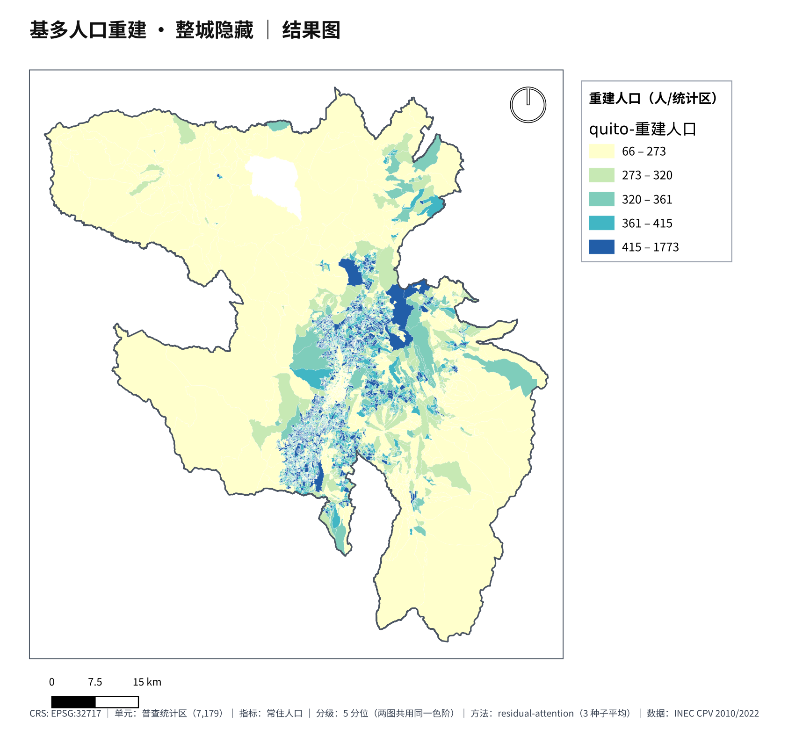
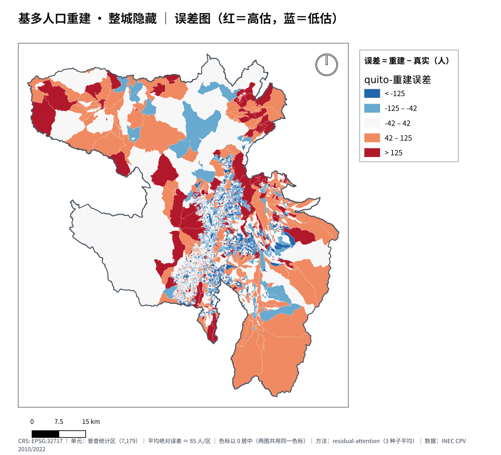
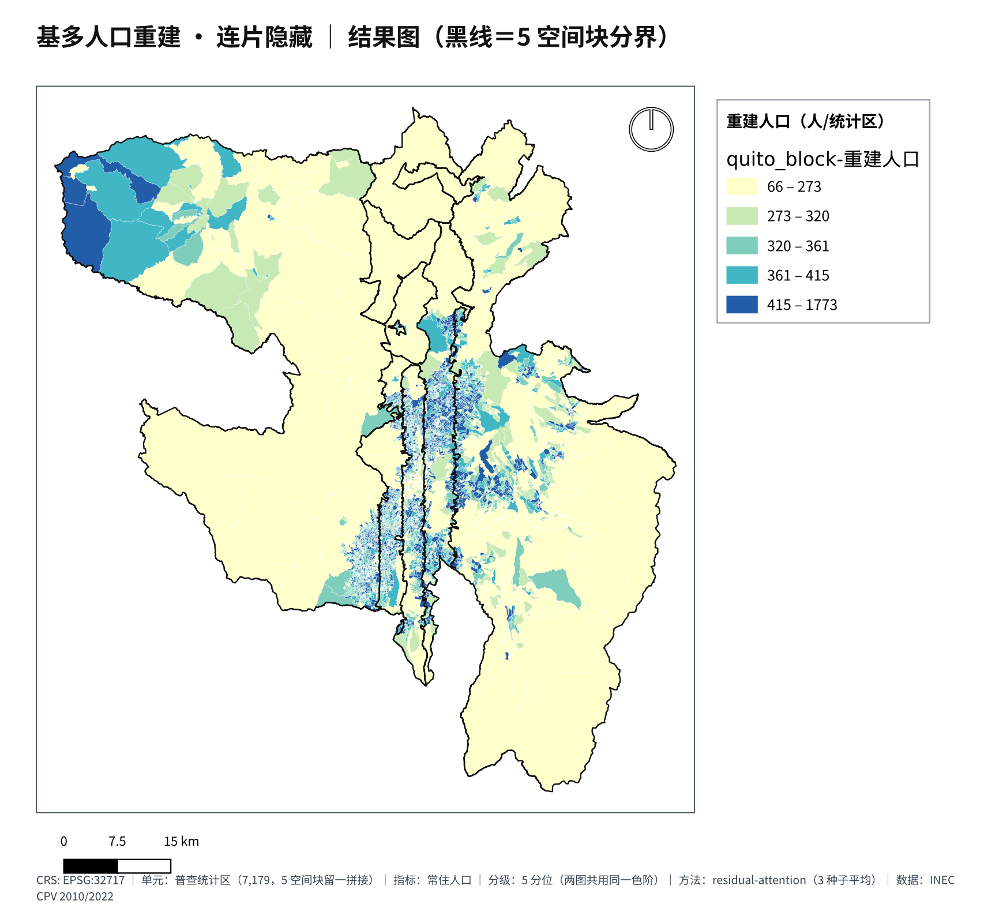
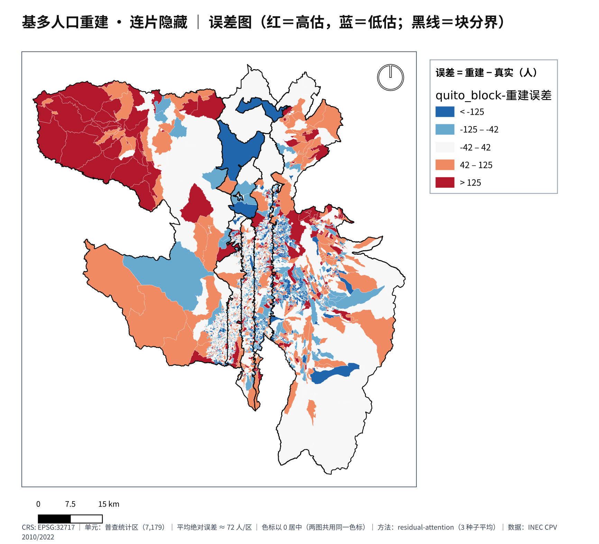

# Ecuador Urban Imputation

使用图注意力网络（GAT）补全普查统计区数据。以厄瓜多尔基多、瓜亚基尔和昆卡为研究对象，将 2010 年与 2022 年普查对齐到同一套边界，利用历史数据和可见邻区信息，估计被隐藏统计区的 2022 年人口、住房和公共服务指标。

## 数据与方法

数据来自厄瓜多尔国家统计与普查局 INEC，覆盖三城共 **15,949 个普查统计区（sector censal）**。2022 年数据产品包含 19 项指标；跨年建模采用统一口径的 13 项人口、住房和服务指标。

同年的指标与边界按 12 位 `tract_id` 连接。2010 年与 2022 年的边界划分不同，先核对两年的字段定义，再按几何重叠面积将 2010 年数据换算到 2022 年边界上。

<details>
<summary><strong>数据处理与质量检查</strong></summary>

- 基多 7,179 个统计区，瓜亚基尔 6,651 个，昆卡 2,119 个。
- 2022 年指标与边界的匹配率约 99.6%。未匹配指标对应匿名化编码，无法落位到具体边界；缺失值保留为空，不填成 0。
- 空间处理使用 EPSG:32717，在米制投影下计算面积、距离和跨年边界重叠。
- 跨年对齐先排除不足 95% 面积落入目标边界的 2010 年统计区，再根据覆盖率和来源碎片数量筛选 2022 年目标区。
- 收入、贫困率、租金和房价没有可用的官方 sector 级来源，不参与建模。

数据来源与校验信息见 [data_sources.csv](data/metadata/data_sources.csv)，2022 年数据字典见 [data_dictionary.csv](data/metadata/data_dictionary.csv)，跨年指标定义见 [indicators.toml](configs/indicators.toml)。

</details>

模型采用 **GAT + 门控融合**，分为两部分：

1. **基底**：编码本区 2010 年特征，并通过注意力聚合邻区的 2010 年信息。
2. **修正**：聚合可见邻区的 2022 年变化，由可学习门控决定修正幅度。

输出可以概括为：`2022 年估计 = 2010 年信息形成的基底 + 门控 × 邻区修正`。没有可见的 2022 年邻居时，修正项关闭，模型退回 2010 年信息形成的基底。

共享边界的统计区互为邻居，没有接壤邻区时使用质心最近者，每区最多取 12 个邻居。邻接特征包含方向和对数距离；被隐藏的 2022 年真值不进入模型输入。

## 实验结果

采用三种遮盖方式，共 **11 折 × 3 个随机种子**，所有方法使用相同划分：

| 设置 | 划分方式 |
|---|---|
| 零散隐藏 | 随机隐藏 10%、20%、30% 的统计区，共 3 折 |
| 整城隐藏 | 每次隐藏一座城市，用另外两城训练，共 3 折 |
| 连片隐藏 | 每城按质心自西向东划为 5 条带，逐条隐藏，共 5 折 |

对照方法包括直接沿用 2010 年值、可见地区均值、反距离加权、岭回归和仅使用本区特征的 MLP。空间消融保持模型架构和实验划分不变，屏蔽全部邻居信息后从头训练。

由于 13 项指标单位不同，MAE_z 和 RMSE_z 将各指标误差除以其 2022 年全体统计区的标准差，再等权平均；R² 按指标等权平均。MAE_z、RMSE_z 越小越好，R² 越大越好。**粗体为该列最优，下划线为最优 baseline。**

<table>
  <thead>
    <tr>
      <th rowspan="2">方法</th>
      <th colspan="3">零散隐藏</th>
      <th colspan="3">整城隐藏</th>
      <th colspan="3">连片隐藏</th>
    </tr>
    <tr>
      <th>MAE<sub>z</sub> ↓</th><th>RMSE<sub>z</sub> ↓</th><th>R² ↑</th>
      <th>MAE<sub>z</sub> ↓</th><th>RMSE<sub>z</sub> ↓</th><th>R² ↑</th>
      <th>MAE<sub>z</sub> ↓</th><th>RMSE<sub>z</sub> ↓</th><th>R² ↑</th>
    </tr>
  </thead>
  <tbody>
    <tr>
      <td>2010 年值直接沿用</td>
      <td>0.731</td>
      <td>1.184</td>
      <td>−2.14</td>
      <td>0.725</td>
      <td>1.123</td>
      <td>−1.10</td>
      <td>0.733</td>
      <td>1.139</td>
      <td>−1.58</td>
    </tr>
    <tr>
      <td>可见地区均值</td>
      <td>0.617</td>
      <td>0.899</td>
      <td>0.07</td>
      <td><ins>0.717</ins></td>
      <td><ins>1.028</ins></td>
      <td><ins>−0.29</ins></td>
      <td>0.644</td>
      <td>0.946</td>
      <td>−0.13</td>
    </tr>
    <tr>
      <td>反距离加权</td>
      <td><ins>0.416</ins></td>
      <td><ins>0.639</ins></td>
      <td><ins>0.45</ins></td>
      <td><ins>0.717</ins></td>
      <td><ins>1.028</ins></td>
      <td><ins>−0.29</ins></td>
      <td>0.648</td>
      <td>0.950</td>
      <td>−0.14</td>
    </tr>
    <tr>
      <td>岭回归</td>
      <td>0.440</td>
      <td>0.663</td>
      <td>0.43</td>
      <td>0.983</td>
      <td>1.202</td>
      <td>−2.17</td>
      <td><ins>0.459</ins></td>
      <td><ins>0.722</ins></td>
      <td><ins>0.26</ins></td>
    </tr>
    <tr>
      <td>MLP</td>
      <td>0.530</td>
      <td>0.747</td>
      <td>0.24</td>
      <td>1.882</td>
      <td>2.281</td>
      <td>−12.25</td>
      <td>0.555</td>
      <td>0.833</td>
      <td>−0.06</td>
    </tr>
    <tr>
      <td>本方法去空间（消融）</td>
      <td>0.372</td>
      <td>0.612</td>
      <td>0.55</td>
      <td>0.449</td>
      <td>0.756</td>
      <td>0.32</td>
      <td>0.401</td>
      <td>0.683</td>
      <td>0.43</td>
    </tr>
    <tr>
      <td><strong>本方法（GAT + 门控）</strong></td>
      <td><strong>0.361</strong></td>
      <td><strong>0.584</strong></td>
      <td><strong>0.58</strong></td>
      <td><strong>0.444</strong></td>
      <td><strong>0.744</strong></td>
      <td><strong>0.33</strong></td>
      <td><strong>0.397</strong></td>
      <td><strong>0.675</strong></td>
      <td><strong>0.44</strong></td>
    </tr>
  </tbody>
</table>

GAT + 门控在三种设置的三项指标上均优于对照方法。空间消融的差异较小：零散隐藏的 MAE_z 从 0.372 降至 0.361，连片隐藏从 0.401 降至 0.397；整城隐藏时缺少可见的同城邻居，估计主要依靠 2010 年基底。

完整数值保存在 [results/metrics.csv](results/metrics.csv)。这些是已有实验结果，本次仓库整理未重新运行全量实验。

下面展示基多人口指标的重建与误差：

| 设置 | 重建人口 | 误差 |
|---|---|---|
| 整城隐藏 |  |  |
| 连片隐藏 |  |  |

整城隐藏下仍能还原基多中心和南北走廊的人口分布。连片隐藏的误差主要集中于人口较大的统计区，人口前 10% 的统计区贡献约 27% 的总误差。

这套方法仍受两次普查字段定义差异和面积插值误差影响，连片隐藏下对邻区信息的利用也较有限。结果适合用于数据补全和初步估计，不能替代正式普查或作为因果结论。

## 使用方式

依赖通过 `uv` 管理，锁定环境为 Python 3.14、PyTorch 2.13。以下命令从仓库根目录运行：

```bash
uv sync --locked --extra dev

# 用合成数据检查准备、训练、评价和报告流程，无需下载普查数据
uv run pytest -q tests/test_reconstruction_experiment.py::test_gat_cpu_end_to_end_and_win_gate_schema
```

<details>
<summary><strong>数据下载与正式实验</strong></summary>

```bash
uv run ecuador-evolution download
uv run ecuador-evolution prepare
uv run ecuador-evolution train --device cpu --parallel-backend serial
uv run ecuador-evolution evaluate --device cpu --parallel-backend serial
uv run ecuador-evolution report --device cpu --parallel-backend serial
```

原始 ZIP 数据约 1.7 GB，下载时校验 SHA-256。默认使用 [reconstruction.toml](configs/reconstruction.toml)，完整调参与多折训练耗时较长；GPU 运行需要兼容 CUDA 13.0 的驱动。

已有预处理数据后，可使用 `--config configs/smoke.toml` 执行较小规模的 CPU 训练。生成结果写入 `artifacts/`，不会覆盖 `results/` 中的参考结果。空间消融、数据导出及其他运行选项见 [运行说明](docs/RUNNING.md)。

</details>

## 代码组织

```text
├── src/ecuador_evolution/  # 跨年对齐、空间邻接、模型与评价
├── configs/               # 数据来源、指标定义和实验配置
├── scripts/               # 单年数据处理、合并导出和空间消融
├── tests/                 # 数据处理、输入遮盖和模型测试
├── data/metadata/         # 数据字典、来源与质量记录
├── results/               # 实验结果表
├── assets/                # 重建结果与误差地图
└── docs/                  # 运行说明与项目来源
```

原始数据和训练产物不随代码提交。项目与数据来源见 [PROVENANCE.md](docs/PROVENANCE.md)。
